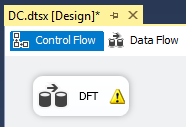
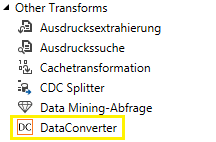
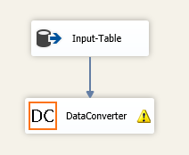
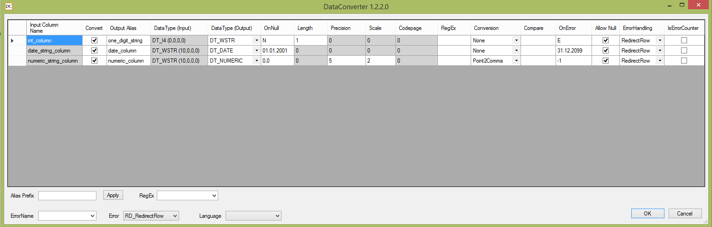

## initions SSIS Component "DataConverter"
"DataConverter" is a custom component for [SQL Server Integration Services](https://en.wikipedia.org/wiki/SQL_Server_Integration_Services). It can be added to the Data Flow of an SSIS-package to convert datatypes. 

In addition this component is able to perform error-handling on non-convertable values, including default values.  
For each selected column a new column containing the converted value is added to the Data Flow.

---

### Requirements for development
* Microsoft VisualStudio 2010 or greater

### Requirements for usage
* Microsoft SSIS 2008R2 / 2012 / 2014

---

###Example 

*Input-table:*

|int_column|date_string_column|numeric_string_column|
|---|---|---|
|1|18.03.2016|10.11|
|20|32.01.2016|NaN|
|NULL|NULL|NULL|
  
For this example, following conversion was configured in DataConverter:

- The 'int-column' of datatype int is converted to nvarchar(1) and named one_digit_string
	- If input is a single digit then return it as string
	- If input is NULL then return 'N' for NULL
	- If conversion is not possible then return 'E' for Error
- The 'date_string_column' of datatype string is converted to date and named date_column
	- If input is a valid date then return it as date
	- If input is NULL then return the date 2000-01-01
	- If conversion is not possible then return the date 2099-12-31
- The 'numeric_string_column' of datatype string is converted to numeric(5,2) and named numeric_column
	- If input can be converted into a valid numeric value then return the numeric value
	- If input is NULL then return the number 0,0
	- If conversion is not possible then return the number -1

*Output-data with converted values:*

|one_digit_string|date_column|numeric_column|
|---|---|---|
|1|2016-03-18|10,11|
|E|2000-01-01|-1.00|
|N|2000-01-01|0,0|

---

### How to use

1. open SSIS Package
2. create DFT and open it 
3. 
4. insert a src-component that gets your data you want to convert (i.e. described Input-table)
5. find DataConverter component in SSIS Toolbox, add it to Data Flow
6. 
7. connect output of src-components to input of DataConverter component
8. 
9. open and configure DataConverter component:
    * 
    * set checkbox "Convert" if you like to convert this column
    * in "Output Alias" enter a new column name for the converted value
    * select new Data Type in "Data Type (Output)"
    * If you like to convert NULL-Input to a default value, set it in "OnNull" (Value in "OnNull" must be of type "Data Type Output)
    * If the input data can not be converted and you want to catch this error, set a default value in "OnError" (Value in "OnError" must be of type "Data Type Output)
10. connect output of DataConverter component to next components input
12. done

---

### Bugs
If you find a bug, please contact us on GitHub

### Changelog
2016-04-01
First Release

### License
[MIT License](LICENSE)